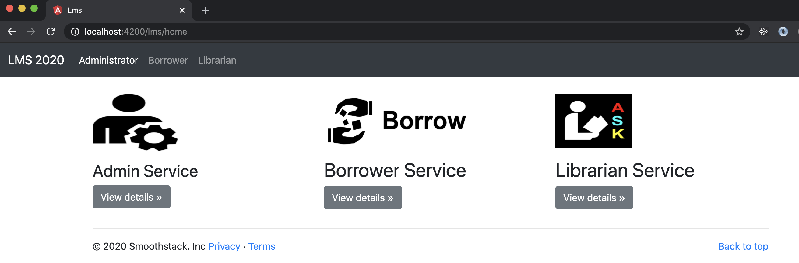
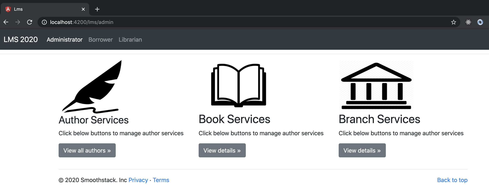
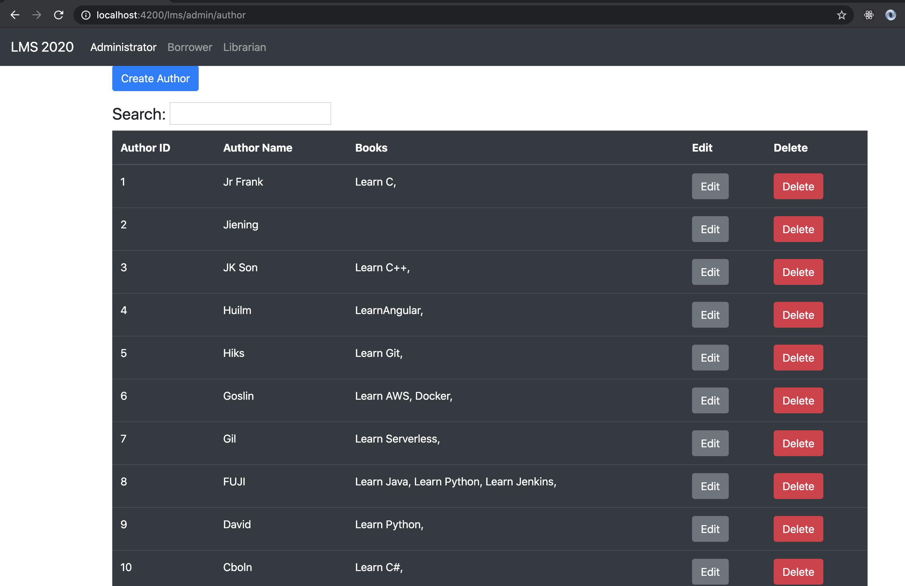

# Build a Library Management System with Angular and Spring Boot

This project demonstrates how to build front end UI with Angular and connect to backend microservices. I chose to use Spring Boot as my backend services. For database, I used MySql here.

## How to use

- Service fold: contains three microservices, which are admin, librarian and borrower services. In order to display data on 

front end UI, you will need to run these three microservices first.

- Web folder: contains front end UI, which is written by Angular.

## Run project

- Step 1, run back end microservices(Spring Boot): `mvn clean` `mvn install`

- Step 2, run front end UI(Angular) : `npm start`

## Sample outputs

### Home page

### Admin service

### Author service

